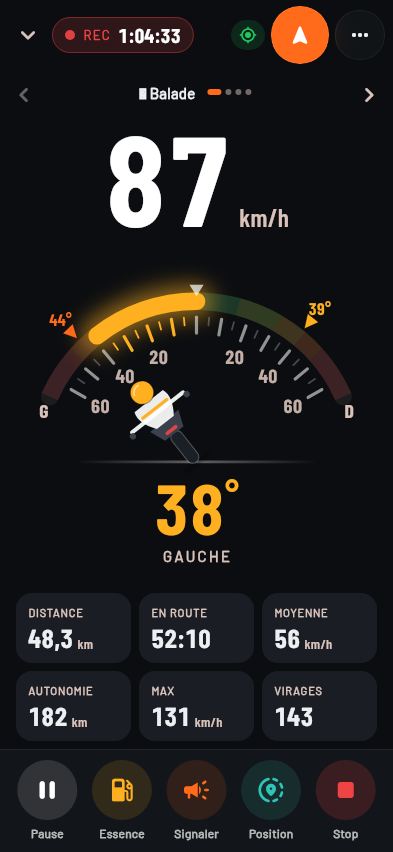
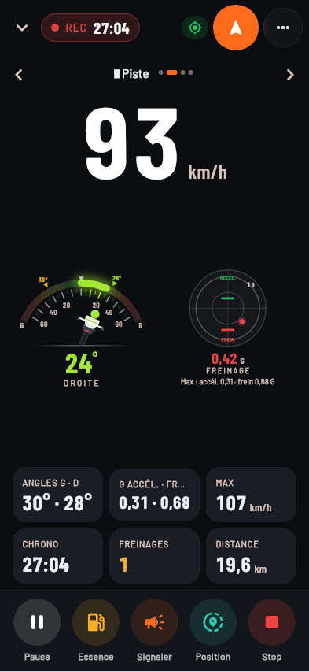
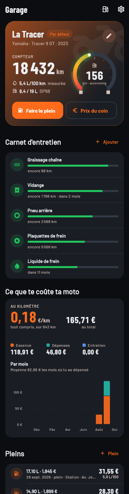
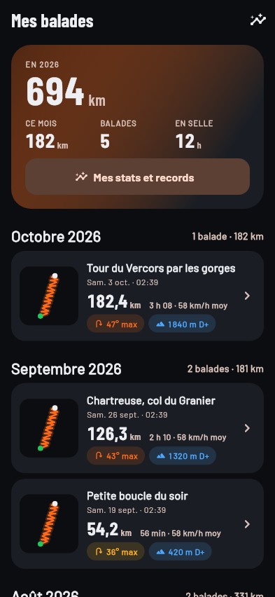
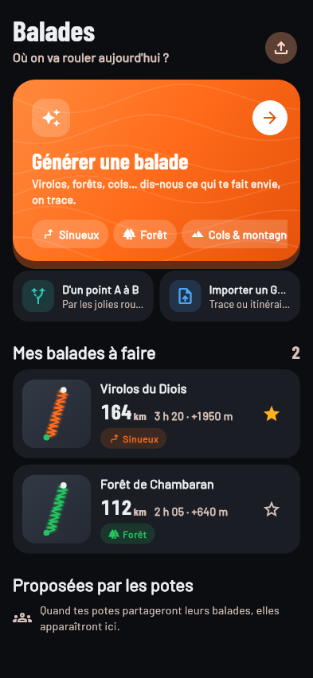
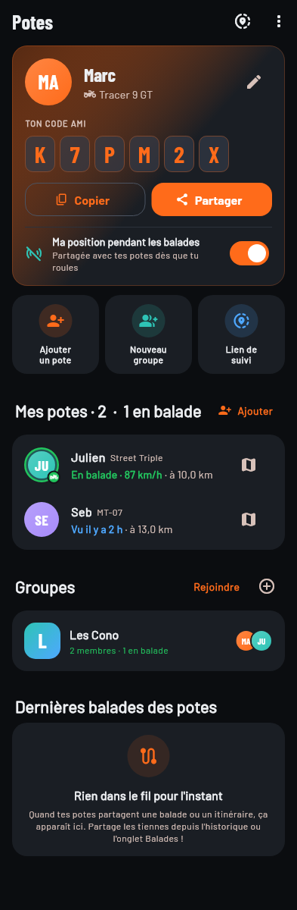

# 🏍️ Cono Moto

L'app gratuite (Android et iPhone) pour les balades moto entre potes : trouver de belles routes, suivre sa trace,
voir ses potes en direct, faire le plein au meilleur prix et savoir à quel point on penche.

<p>
  
  
  
  
  
  
</p>

## Ce que fait l'app

| | |
|---|---|
| 🗺️ **Balades à faire** | Génération de boucles ou d'allers simples selon le type de tracé : **sinueux, forêt, cols & montagne, plat & cool, rapide, mixte**. Score de sinuosité, dénivelé, météo sur le parcours, import/export GPX, balades partagées par les potes. |
| 🧭 **Navigation façon Waze** | En roulant, plan plein écran qui tourne avec toi (motard dans le tiers bas, zoom selon la vitesse), flèche et distance du prochain virage en gros, « puis… », heure d'arrivée, km et temps restants, annonces vocales qui baissent la musique, **recalcul automatique** si tu te trompes, incidents sur ta route, bouton **Signaler** en 2 touches. **« Où on va ? »** : cherche une adresse, choisis « le plus rapide » ou « par les petites routes », c'est parti. |
| 📍 **Suivi GPS** | Enregistrement de la balade même écran éteint ; le compteur (vitesse, angle, stats) est à un appui du plan. |
| 📐 **Angle d'inclinaison** | Jauge en direct, angle max gauche/droite, répartition des angles (téléphone fixé sur le guidon). |
| 📊 **Stats** | Vitesse moyenne/max, freinages et accélérations forts, D+, nombre de virages, records, km par mois. |
| 🕓 **Historique** | Toutes tes balades avec carte, graphes vitesse/angle, coût de la balade, « refaire cette balade ». |
| ⛽ **Essence** | Stations autour de toi ou le long de l'itinéraire avec le **prix du moment** (données officielles prix-carburants.gouv.fr), la moins chère mise en avant, prix affichés directement sur la carte. |
| 💶 **Coût des balades** | Pleins, péages, restos… coût par balade, coût au km, conso calculée automatiquement. |
| 🛢️ **Autonomie** | Estimation des km restants dans le réservoir, alerte avant la panne sèche avec les stations sur ta route. |
| 🔧 **Carnet d'entretien** | Graissage chaîne, vidange, pneus, plaquettes, révision : rappels au kilométrage. |
| 🚧 **Trafic temps réel** | Accidents, travaux, routes fermées sur la carte, alerte si un incident est sur ton itinéraire. |
| 👥 **Potes en direct** | Positions des potes sur la carte, statut (en balade à 87 km/h, vu il y a 2 h…). |
| 📢 **Signalements** | Gravillons, contrôle, danger, huile… visibles par tes potes. |
| 🏁 **Mode groupe** | Point de regroupement partagé, alerte quand un pote décroche. |
| 🧾 **Partage des frais** | Façon Tricount : qui a payé quoi, qui doit combien à qui. |
| 📟 **Compteur à ta façon** | Des vues compteur par activité (Balade, Piste, Trail, Tranquille… ou les tiennes) qu'on fait défiler en roulant ; tu choisis les infos affichées, dont le **cercle des G** (accélération, freinage, force en virage). |
| 🔄 **Mises à jour automatiques** | Au démarrage, l'app te montre les nouveautés et se met à jour en un appui (Android). Sur iPhone, via SideStore sans ordinateur. |
| 💡 **Boîte à idées** | Propose une idée ou signale un bug depuis l'app : ça part sur le Discord de la bande, les potes votent 👍, et c'est traité. |
| 🔗 **Partage de position** | Lien web de suivi en direct pour quelqu'un qui n'a pas l'app (valable 1 h, 4 h ou 12 h). |
| 🆘 **Détection de chute** | Choc violent puis immobilité → compte à rebours, puis SMS automatique avec ta position à ton contact d'urgence + alerte aux potes (sur iPhone, le SMS est préparé : il reste à appuyer sur Envoyer, [voir plus bas](#-iphone)). |
| 📴 **Cartes hors-ligne** | Télécharge une zone ou le couloir d'une balade avant de partir en zone blanche. |

Tout est gratuit : cartes OpenFreeMap / OpenStreetMap, itinéraires Valhalla (FOSSGIS), météo Open-Meteo,
prix officiels des carburants, Firebase (offre gratuite) pour les potes, TomTom (offre gratuite) pour le trafic.

---

## 📲 Installer l'app sur ton téléphone

### 🤖 Android

L'APK est compilé automatiquement par GitHub Actions à chaque push, un par type de processeur (≈ 40 Mo) :
`cono-moto.apk` pour presque tous les téléphones (arm64) et `cono-moto-armeabi-v7a.apk` pour les vieux
téléphones 32 bits.

**Le plus simple (pour les potes)** : envoie-leur le lien de la page des versions,
<https://github.com/mvlemincks-ouwba/cono-moto/releases/tag/derniere-version> : tout y est expliqué,
sans compte GitHub, et l'app se met ensuite à jour toute seule ([détails](#5-mises-à-jour-automatiques--gratuit)).

1. Sur GitHub, onglet **Actions** › dernier run **« APK Android »** réussi › section **Artifacts** › télécharge
   **cono-moto-apk** (un zip qui contient les deux APK).
   Sur la branche `main`, les APK sont aussi publiés dans la release **« derniere-version »** (onglet *Releases*).
2. Copie `cono-moto.apk` sur le téléphone et ouvre-le (sur un vieux téléphone 32 bits qui le refuse :
   `cono-moto-armeabi-v7a.apk`). Android te demandera d'autoriser l'installation
   depuis cette source (« sources inconnues ») : accepte.
3. Les mises à jour s'installent par-dessus sans perdre tes données (toutes les versions sont signées avec la même clé).
   Les versions de `main` sont proposées par l'app elle-même au démarrage (Réglages › Mises à jour).

### 🍏 Installer sur iPhone avec Sideloadly (gratuit)

Apple n'autorise pas d'installer une app « à la main » comme un APK. La solution gratuite : **Sideloadly**,
un logiciel pour PC ou Mac qui signe l'app avec ton **Apple ID gratuit** et l'installe par le câble.
Contrepartie : l'app doit être **réinstallée tous les 7 jours** (2 minutes, tes données sont gardées).

**Une seule fois :**

1. **Récupère l'IPA** (le fichier de l'app iPhone) : sur GitHub, onglet **Actions** › workflow **« IPA iPhone »**.
   S'il n'y a pas de run récent, clique **Run workflow** (≈ 20 min). Ouvre le dernier run réussi › section
   **Artifacts** › télécharge **cono-moto-ipa** et dézippe-le : tu obtiens `cono-moto-unsigned.ipa`.
   (Sur `main`, l'IPA est aussi dans la release **« derniere-version »**, onglet *Releases*.)
2. **Installe Sideloadly** depuis <https://sideloadly.io> (Windows 10/11 ou macOS).
   **Sur Windows**, installe aussi **iTunes** et **iCloud** depuis le site d'Apple (les versions
   « web », *pas* celles du Microsoft Store) : Sideloadly en a besoin pour parler à l'iPhone.
3. **Branche l'iPhone** au PC avec un câble, déverrouille-le et réponds **« Faire confiance »** à l'ordinateur.
4. Ouvre Sideloadly, **glisse `cono-moto-unsigned.ipa`** dans la fenêtre, vérifie que ton iPhone est
   sélectionné, tape ton **Apple ID** (un Apple ID gratuit suffit ; un compte secondaire est une bonne idée)
   puis **Start**. Mot de passe et code de validation à deux facteurs si demandé.
   Ne change pas le *Bundle ID* dans les options avancées (il doit rester `fr.conomoto.conoMoto`).
5. **Active le mode développeur** (iOS 16 et plus) : **Réglages › Confidentialité et sécurité ›
   Mode développeur** › activer, l'iPhone redémarre, confirme **Activer**. (Ce menu n'apparaît qu'après
   une première installation par Sideloadly.)
6. **Fais confiance au profil** : **Réglages › Général › VPN et gestion de l'appareil** › ton Apple ID ›
   **Faire confiance**.
7. Lance **Cono Moto** : autorise la position **« Lorsque l'app est active »** en gardant **« Position exacte »**
   activée, puis les notifications.

**Tous les 7 jours :** l'app ne s'ouvre plus → rebranche l'iPhone et refais l'étape 4 avec le même IPA et le
même Apple ID (ou un IPA plus récent pour mettre à jour) : l'app est remplacée **sans perdre tes données**.
Sideloadly propose aussi une option de rafraîchissement automatique (le PC doit rester allumé, iPhone sur le même Wi-Fi).

**Limites d'un Apple ID gratuit :** 3 apps installées ainsi en même temps au maximum, validité 7 jours,
pas de notifications push à distance (Cono Moto n'utilise que des notifications locales et le suivi GPS
en arrière-plan, qui marchent très bien sans compte payant).

> Option payante : avec un compte Apple Developer (99 €/an), **TestFlight** évite les 7 jours et l'installation
> par câble (préparé dans [`.github/workflows/ios.yml`](.github/workflows/ios.yml), à activer).

> L'app fonctionne **immédiatement en mode solo** (balades, GPS, stats, essence, garage, cartes hors-ligne).
> Pour les fonctions entre potes et le trafic, il faut les clés ci-dessous (15 minutes, une seule fois).

---

## 🍏 iPhone

**Ce qui marche pareil que sur Android :** cartes et cartes hors-ligne, balades à faire, guidage vocal
(y compris écran verrouillé et dans l'intercom Bluetooth, la musique baisse le temps de l'annonce),
enregistrement GPS, angle d'inclinaison, stats, historique, essence, garage, trafic, potes en direct,
groupes, signalements, partage des frais, lien de suivi, écran toujours allumé, notifications.

**Les différences :**

- 🆘 **Pas de SMS automatique en cas de chute.** Apple interdit à une app d'envoyer un SMS toute seule.
  À la fin du compte à rebours, **tes potes sont alertés automatiquement** (comme sur Android), une
  notification s'affiche et l'écran **Messages s'ouvre avec le SMS déjà écrit** (ta position, l'heure) :
  il reste à appuyer sur **Envoyer** (toi, ou un témoin). Un gros bouton « Envoyer le SMS à … » et un
  bouton « Appeler … » restent affichés. Si personne ne touche le téléphone, seule l'alerte aux potes part :
  roule avec des potes qui ont l'app, et garde le 112 en tête.
- 📍 **Suivi écran éteint géré par iOS.** La permission « Lorsque l'app est active » suffit : une balade
  lancée continue d'être enregistrée écran verrouillé (pastille bleue en haut de l'écran), sans
  notification permanente. Mais si tu **fermes l'app** (balayage vers le haut dans le sélecteur d'apps),
  iOS arrête le GPS : laisse-la simplement en arrière-plan. Hors balade, rien n'est suivi.
- 🎯 Si tu as choisi « Position approximative », l'app demande la position exacte au départ de la balade.
- 📂 Import GPX : par le bouton d'import de l'app (sélecteur *Fichiers*) ; l'export passe par le partage iOS
  (« Enregistrer dans Fichiers », AirDrop, Messages…).
- 🔋 Mode économie d'énergie : il peut espacer les positions GPS, évite-le pendant une balade.

**Installer l'app sur un iPhone, honnêtement :**

| | Coût | Contraintes |
|---|---|---|
| **Sideloadly + Apple ID gratuit** ([pas à pas](#-installer-sur-iphone-avec-sideloadly-gratuit)) | Gratuit | Un PC ou Mac et un câble, réinstallation tous les 7 jours, 3 apps max |
| **TestFlight** | 99 €/an (compte Apple Developer) | Le plus simple pour les potes : lien d'invitation, mises à jour automatiques, build valable 90 jours. À activer dans `ios.yml` (secrets App Store Connect) |
| **Mac + Xcode + câble** | Gratuit | `open ios/Runner.xcworkspace`, choisir ton équipe personnelle, ▶︎. Aussi 7 jours avec un Apple ID gratuit |

Identifiant de l'app iOS (bundle id) : `fr.conomoto.conoMoto`. Aucune capacité payante (push, alertes
critiques, App Groups…) n'est activée : l'app s'installe avec un Apple ID gratuit.

---

## ⚙️ Configuration (une seule fois)

Les clés se mettent dans les **secrets du dépôt GitHub** : *Settings › Secrets and variables › Actions ›
New repository secret*. Le prochain build les intègre automatiquement.

### 1. Firebase (potes en direct, groupes, partage) — gratuit

1. Va sur <https://console.firebase.google.com> › **Ajouter un projet** (Google Analytics inutile).
2. **Build › Authentication** › *Get started* › active **E-mail/Mot de passe**.
3. **Build › Realtime Database** › *Créer une base de données* › emplacement **europe-west1** ›
   démarrer en **mode verrouillé**. Puis onglet **Règles** : colle le contenu de
   [`firebase/database.rules.json`](firebase/database.rules.json) et publie.
4. **Paramètres du projet** (roue dentée) › *Vos applications* › icône **Android** › nom du package
   `fr.conomoto.cono_moto` › enregistrer (pas besoin de télécharger `google-services.json`).
   Pour l'iPhone : *Ajouter une application* › icône **iOS** › ID du bundle **`fr.conomoto.conoMoto`** ›
   enregistrer (pas besoin de télécharger `GoogleService-Info.plist`).
5. Dans les paramètres du projet, récupère et ajoute ces secrets GitHub :

| Secret GitHub | Où le trouver |
|---|---|
| `FIREBASE_API_KEY` | Paramètres du projet › Général › *Clé API Web* |
| `FIREBASE_APP_ID` | Paramètres › Vos applications › appli Android › *ID d'application* (`1:…:android:…`) |
| `FIREBASE_IOS_APP_ID` | Paramètres › Vos applications › appli iOS › *ID d'application* (`1:…:ios:…`). Sans lui, l'app iPhone est en mode solo |
| `FIREBASE_IOS_CLIENT_ID` | (facultatif, inutile pour l'instant) appli iOS › *ID client* |
| `FIREBASE_MESSAGING_SENDER_ID` | Paramètres › Cloud Messaging › *ID de l'expéditeur* (le nombre au milieu de l'App ID) |
| `FIREBASE_PROJECT_ID` | Paramètres › Général › *ID du projet* |
| `FIREBASE_DATABASE_URL` | Realtime Database › l'URL en haut (`https://<projet>-default-rtdb.europe-west1.firebasedatabase.app`) |
| `FIREBASE_STORAGE_BUCKET` | (facultatif) Paramètres › Général › *Bucket de stockage* |

La même clé API web sert aux deux applis (si tu l'as restreinte dans Google Cloud, autorise aussi l'appli iOS
`fr.conomoto.conoMoto`). L'offre gratuite (Spark) suffit largement pour une bande de potes.

### 2. Page de suivi en direct (lien pour quelqu'un sans l'app) — gratuit

La page [`web_share/live.html`](web_share/live.html) s'héberge gratuitement sur Firebase Hosting :

```bash
npm install -g firebase-tools
firebase login
cd firebase
firebase use --add            # choisis ton projet
./deploy.sh                   # règles de sécurité + page de suivi
```

Puis ajoute le secret `SHARE_VIEWER_URL` = `https://<projet>.web.app/live.html`.
Détails dans [`firebase/README.md`](firebase/README.md).

### 3. Trafic temps réel (accidents, travaux, fermetures) — gratuit

1. Crée un compte sur <https://developer.tomtom.com> et copie ta clé API (offre gratuite : 2 500 requêtes/jour).
2. Soit tu ajoutes le secret GitHub `TOMTOM_API_KEY` (clé intégrée pour tous), soit chacun colle la clé dans
   l'app : **Garage › ⚙ Réglages › Trafic en temps réel › Clé TomTom**.

### 4. Boîte à idées sur Discord — gratuit

Dans l'app (**Réglages › Communauté**, ou menu ⋮ de l'onglet Potes), chacun peut proposer une idée ou
signaler un bug, avec une capture d'écran. Ça part dans un **salon Discord** (salon texte ou forum) :
une demande = un fil, les potes en discutent et votent 👍. On peut aussi écrire directement dans le salon.
Dans un **salon texte**, chaque message est une demande et le bot ouvre un fil dessous : pour en discuter,
réponds dans le fil, pas dans le salon. Dans un **forum**, chaque post est déjà un fil.

**a) Le salon et le webhook (pour l'app)**
1. Sur ton serveur Discord, crée un salon, par ex. `💡-idées` : un **salon texte** classique, ou un **Forum**
   (tags facultatifs : « Idée », « Bug »).
2. Paramètres du salon › **Intégrations › Webhooks › Nouveau webhook** › nomme-le « Cono Moto » › **Copier l'URL**.
3. Secret GitHub **`DISCORD_FEEDBACK_WEBHOOK`** = cette URL.
4. (Facultatif) Un lien d'invitation permanent au serveur → secret **`DISCORD_INVITE_URL`** (bouton « Rejoindre le Discord »).
5. Salon texte : poste un message « 📌 Comment ça marche » (le principe en deux lignes) et **épingle-le**
   (clic droit › Épingler). Le bot ignore les messages épinglés : celui-là ne deviendra jamais une demande.

> L'URL du webhook est intégrée à l'app : quelqu'un qui décortique l'APK pourrait poster dans ce salon.
> En cas d'abus, supprime le webhook, crée-en un autre et mets à jour le secret.

**b) Le pont Discord → GitHub (pour que les demandes soient traitées)**

Toutes les heures, le workflow « Boîte à idées » ouvre un fil sous chaque nouvelle demande (salon texte,
parmi les 100 derniers messages), recopie chaque nouveau fil en ticket GitHub (étiquette `feedback`) et répond
« 📌 Bien reçu » dans le fil, met à jour le nombre de 👍, recopie sur le ticket les réponses des potes dans le fil,
reposte dans Discord les réponses écrites sur le ticket, et annonce « ✅ C'est fait » quand le ticket est fermé.
1. <https://discord.com/developers/applications> › **New Application** « Cono Moto » › onglet **Bot** › **Reset Token** › copie le jeton
   → secret **`DISCORD_BOT_TOKEN`**. Sur la même page, active **Message Content Intent**.
2. Onglet **OAuth2 › URL Generator** : scope `bot`, permissions *View Channels*, *Read Message History*,
   *Send Messages*, *Send Messages in Threads*, *Create Public Threads* › ouvre l'URL générée et ajoute le bot
   à ton serveur. (Bot déjà ajouté sans *Create Public Threads* ? Donne-la-lui dans les permissions du salon.)
3. Dans Discord : Paramètres utilisateur › Avancés › **Mode développeur** ; clic droit sur le salon › **Copier l'identifiant**
   → secret **`DISCORD_FORUM_CHANNEL_ID`** (même nom pour un salon texte ; **`DISCORD_CHANNEL_ID`** marche aussi).
4. Test : onglet **Actions › Boîte à idées (Discord ↔ GitHub) › Run workflow**.

Les messages postés par le webhook sans la fiche de l'appli (mode d'emploi, réponses, annonces) ne deviennent
jamais des demandes, et dans un salon texte les messages antérieurs à `DISCORD_SINCE_ID` (variable du dépôt,
réglée dans le workflow sur la mise en route du bot) sont ignorés.

**c) Le traitement** : chaque matin, une routine Claude Code lit les nouveaux tickets `feedback` (et les réponses
aux questions qu'elle a posées), répond aux potes (sa réponse est repostée dans le fil Discord), trie avec les
étiquettes `accepté` / `à-préciser` / `à-discuter` / `pas-prévu`, et prépare une pull request pour ce qui est
simple et clair. Tu n'as plus qu'à fusionner : le ticket se ferme et le fil Discord annonce « C'est fait ».

### 5. Mises à jour automatiques — gratuit

L'app vérifie au démarrage (au plus toutes les 6 h, jamais pendant une balade) s'il existe une nouvelle version,
affiche ce qui a changé et, sur Android, la télécharge et l'installe en un appui. La première fois, Android
demande d'autoriser Cono Moto à installer ses mises à jour ; ensuite, à partir d'Android 12, elles peuvent
s'installer sans confirmation. Sur iPhone, l'app prévient et la mise à jour passe par SideStore ou Sideloadly.

Sur Android, l'app télécharge l'APK de son type de processeur. En Wi-Fi, elle le télécharge même en douce dès
qu'elle trouve la nouvelle version (jamais sur les données mobiles ni pendant une balade) : « Mettre à jour »
l'installe alors en quelques secondes. Réglage « Télécharger les mises à jour en Wi-Fi » (Réglages › Mises à jour).

Rien à configurer : à chaque fusion dans `main`, les builds **APK Android** et **IPA iPhone** publient dans la
release [**« derniere-version »**](https://github.com/mvlemincks-ouwba/cono-moto/releases/tag/derniere-version)
de ce dépôt les APK, l'IPA, `android.json` / `ios.json` (version + quoi de neuf, lus par l'app), la source SideStore
`sidestore.json` et, en texte de la page, le mode d'emploi pour les potes
(tiré de [`docs/releases/README.md`](docs/releases/README.md)).

⚠️ Le dépôt doit rester **public** : l'app télécharge ses mises à jour sans compte GitHub. S'il redevenait privé,
les mises à jour automatiques s'arrêteraient.

Les téléphones qui ont une version d'avant cette fonction doivent installer une fois la nouvelle version à la main
(depuis la page « derniere-version ») ; ensuite c'est automatique. Pareil pour un vieux téléphone 32 bits resté
en build 54 ou moins : cette version-là ne connaît que `cono-moto.apk` (arm64), il faut installer une fois
`cono-moto-armeabi-v7a.apk` à la main.

### 6. (Facultatif) Ta propre clé de signature

Par défaut, l'APK est signé avec la clé partagée `android/app/cono-shared.keystore` versionnée dans ce dépôt
(pratique pour installer les mises à jour par-dessus). Le dépôt étant public, cette clé et son mot de passe sont
visibles de tous : quelqu'un pourrait signer une fausse appli qu'Android accepterait comme mise à jour de
Cono Moto. Les mises à jour de l'app viennent toujours de la release « derniere-version » ; n'installe pas
d'APK Cono Moto venu d'ailleurs.

Pour utiliser ta propre clé (gardée secrète), ajoute les secrets `KEYSTORE_BASE64` (keystore encodé en base64),
`KEYSTORE_PASSWORD`, `KEY_ALIAS` et `KEY_PASSWORD`.
⚠️ Changer de clé oblige à désinstaller l'ancienne version (les données locales sont perdues).

---

## 🧑‍💻 Développement

- Flutter **3.47** / Dart 3.13, Android et iOS (iOS 15 minimum, imposé par Firebase ; iPhone uniquement).
- Le build iPhone tourne sur GitHub Actions (macOS) : [`.github/workflows/ios.yml`](.github/workflows/ios.yml),
  lancé à la main, sur les pull requests vers `main`, sur `main` et sur les tags `v*`.
  En local, il faut un Mac avec Xcode : `flutter build ios --no-codesign` ou `open ios/Runner.xcworkspace`.
- Architecture : Riverpod 3 (sans génération de code), SQLite (`sqflite`) pour les données locales,
  Firebase Realtime Database pour les potes, MapLibre pour la carte.

```bash
flutter pub get
flutter analyze
flutter test
flutter run --dart-define-from-file=build-config.json   # facultatif : clés en local
```

Captures d'écran (données fictives, polices Barlow à télécharger dans un dossier) :

```bash
flutter test tool/screenshots/screens_test.dart --update-goldens --dart-define=FONTS_DIR=/chemin/vers/polices
```

`build-config.json` (non versionné) a le même format que celui généré par la CI :

```json
{
  "FIREBASE_API_KEY": "...", "FIREBASE_APP_ID": "...", "FIREBASE_IOS_APP_ID": "...", "FIREBASE_MESSAGING_SENDER_ID": "...",
  "FIREBASE_PROJECT_ID": "...", "FIREBASE_DATABASE_URL": "...", "FIREBASE_STORAGE_BUCKET": "",
  "TOMTOM_API_KEY": "...", "SHARE_VIEWER_URL": "..."
}
```

Icônes iOS (même visuel que l'icône Android) : `python3 tool/icons/render_icons.py` (Pillow).

### Organisation du code

```
lib/
  core/          socle : géo, carte (CmMap), thème, réglages, localisation, notifications
  data/          modèles, base SQLite, dépôts
  features/
    map/         carte principale (potes, signalements, trafic, stations, bouton Rouler)
    ride/        balade en cours : GPS, capteurs, angle, chute, HUD, récap
    routes/      balades à faire : génération, guidage, météo, GPX
    social/      potes, groupes, frais partagés, partage de position, SOS
    fuel/        stations et pleins
    garage/      motos, autonomie, entretien, coûts
    history/     historique, détail d'une balade, stats
    traffic/     incidents TomTom
    offline/     cartes hors-ligne
    settings/    réglages
  services/      clients des API (carburants, itinéraires, trafic, Firebase…)
web_share/       page web de suivi en direct
firebase/        règles de sécurité et hébergement
android/         MainActivity.kt : canaux natifs fr.conomoto/native (SMS automatique, écran allumé)
                 et fr.conomoto/updater (installation des mises à jour, processeur, Wi-Fi)
ios/             AppDelegate.swift : même canal (écran allumé, écran Messages pré-rempli), session audio
```

### Sources de données

© contributeurs [OpenStreetMap](https://www.openstreetmap.org/copyright), [OpenFreeMap](https://openfreemap.org),
[prix-carburants.gouv.fr](https://www.prix-carburants.gouv.fr) (licence ouverte),
[Valhalla / FOSSGIS](https://valhalla1.openstreetmap.de), [Open-Meteo](https://open-meteo.com),
[TomTom](https://developer.tomtom.com), [Photon / Komoot](https://photon.komoot.io).
